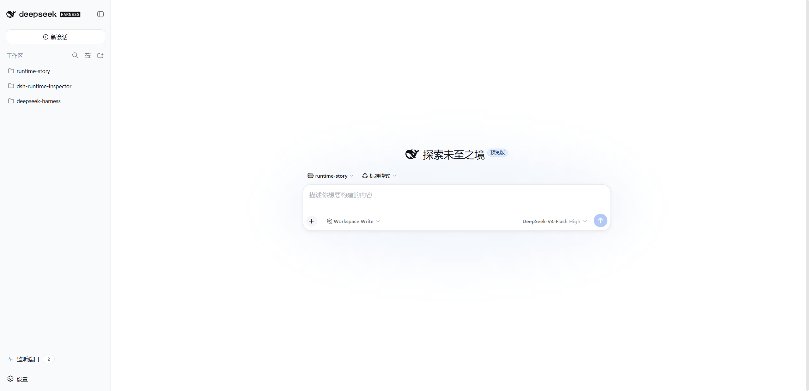
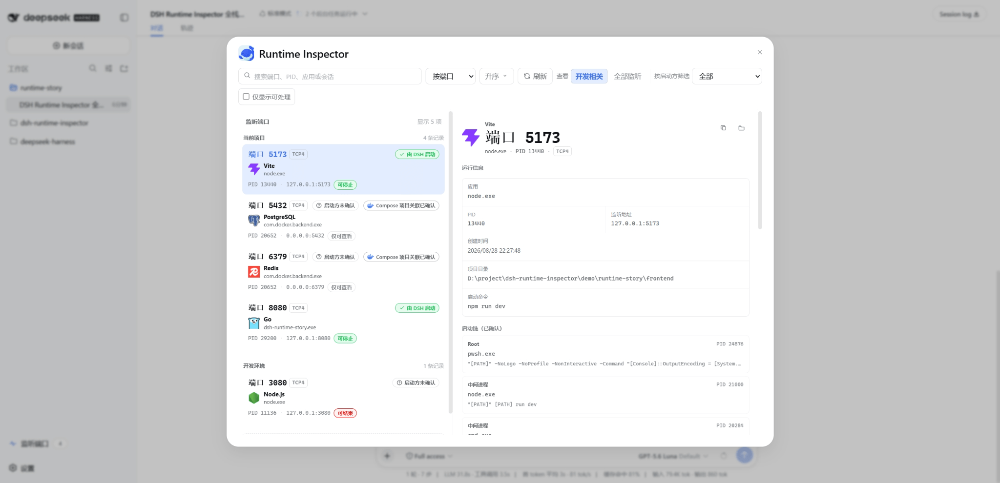

<div align="center">
  
  <h1>DSH Port Inspector</h1>
  <p>DSH Web 内面向 Windows 本地开发的端口来源追踪与安全处理工具。</p>
  <p><strong>中文</strong> | <a href="./README_EN.md">English</a></p>
</div>

## 为什么要做

当 Coding Agent 启动多个本地服务后，用户仍然很难判断当前机器上的端口属于谁、为什么还在运行，以及是否可以安全关闭。

这类问题几乎会在每次多服务联调、后台任务持续运行或多项目并行开发的 Session 中出现。它并不局限于某一种语言或框架：

- 同一个项目开启多个 Session 调试时，Vite 端口发生漂移，浏览器访问到的实例与当前任务不一致；
- 之前的开发服务没有及时清理，过后仍然占用某个端口，用户却已经忘记它为何存在；
- 多个项目、多个会话并行开发时，多个 `node.exe`、Go 或 Python 进程名称相同，用户难以判断某个端口属于哪个项目。

用户会逐步遇到以下问题：

1. **我访问的到底是哪一个服务？**

   页面没有更新，API 返回旧数据，Vite 自动换到了另一个端口，测试和浏览器看到的可能不是同一个实例。我需要知道当前有哪些开发服务正在监听，以及哪个服务属于正在进行的项目。

2. **这个服务为什么还在运行？**

   任务已经完成，服务却仍在后台运行；Session 已经切换，我也记不清 Agent 曾经启动过哪些服务。后台服务持续运行有时是故意的，方便用户继续验证；问题在于，对话上下文淡出后，我很难判断它是否仍然有用。

3. **我敢不敢关闭它？**

   任务管理器里可能同时存在多个 `node.exe`、Go 或其他运行时进程。我会纠结关闭错项目，也无法判断某个监听 PID 是否属于更大的进程树，或者 DeepSeek Harness 的 Job/Terminal 是否仍然使用它。

4. **关闭后真的完成收尾了吗？**

   即使执行了停止操作，我仍需要确认目标端口是否真的释放，以及其他项目的服务是否继续运行。例如，停止前端服务的 5173 后，5174 上的后端服务不应受到影响。

问题在于：DeepSeek Harness 不知道 Agent 到底启动了什么服务，Windows 也不知道某个监听端口属于哪个 DeepSeek Harness Session，两边对不上。打开 Port Inspector，能看到每个监听端口对应的应用、项目、启动方和 Session/Tool Call，每次操作后还会重新扫描确认结果。

后台服务不会被当成泄漏自动清理；只有证据充分时才建议关闭，并区分哪些服务由 DeepSeek Harness 管理、哪些服务不是。

在来源 observer、Windows 进程身份和父进程链均可用时，Port Inspector 把这条关系连接起来：

```text
TCP 监听端口 → 监听 PID → Windows 父进程链 → DeepSeek Harness 根进程
→ Session / Tool Call → 生命周期 owner → 安全处理并确认端口释放
```

## 插件截图

### DeepSeek Harness 任务上下文

下面的画面记录了在 DeepSeek Harness 中选择某项目 `runtime-story` 工作区并打开 Port Inspector 入口的任务上下文。图中的徽标是截图时刻的已有监听数量。



### Port Inspector 运行结果

当前项目分组包含 Vite、PostgreSQL、Redis 和 Go 4 条记录，侧边栏徽标显示 `4`。其中 Docker 服务的 Compose 项目关联已确认，但启动方仍显示为未确认，这两个状态分别表达“属于哪个项目”和“由谁启动”。



| 服务 | 启动方式 | 端口 | Port Inspector 中的含义 |
| --- | --- | ---: | --- |
| Vite | DeepSeek Harness 后台 Job 执行 `npm run dev` | 5173 | 当前项目、当前 Session、verified 来源，可停止 DeepSeek Harness 任务 |
| Go API | DeepSeek Harness 后台 Job 执行 `go run .` | 8080 | 当前项目、当前 Session、verified 来源，可停止 DeepSeek Harness 任务 |
| PostgreSQL | Docker Compose | 5432 | 当前项目 Compose 关联、镜像/容器证据，启动方未确认、仅可查看 |
| Redis | Docker Compose | 6379 | 当前项目 Compose 关联、镜像/容器证据，启动方未确认、仅可查看 |

演示收尾时，先通过 Port Inspector 停止 Vite，重新扫描确认 `5173` 已释放且 `8080`、`5432`、`6379` 仍在监听；再停止 Go，最后执行 `docker compose down`。这能证明处理只影响明确选中的 DeepSeek Harness 服务，不会误伤其他项目或 Docker Desktop。

## 相关术语

| 名词 | 用人话解释 |
| --- | --- |
| **由 DSH 启动** | 已确认这个服务是由某个 DSH 任务启动的。 |
| **启动方未确认** | 目前还无法确认是谁启动了这个服务。 |
| **Docker Compose 项目关联已确认** | 已确认这个端口对应当前项目中的 Docker Compose 服务。 |
| **可停止** | 可以通过 DSH 的 Job 或 Terminal 停止这个服务。 |
| **可结束** | 可以在安全核对后结束这个外部进程。 |
| **仅可查看** | 当前只能查看信息，不能停止或结束这个进程。 |

## 和已有方案的区别

| 方案 | 能看到或做到什么 | 缺少什么 |
| --- | --- | --- |
| `netstat` / `Get-NetTCPConnection` | 端口、地址和 PID | 不知道哪个 DeepSeek Harness Session 或 Tool Call 启动了进程 |
| 任务管理器 / Process Explorer | 进程信息、父子关系和结束进程 | 不理解 DeepSeek Harness Job / Terminal 生命周期 |
| DeepSeek Harness Jobs / Terminals | 管理已知的受管资源 | 不提供统一的 Windows 监听端口视图，也不覆盖外部进程 |
| Port Inspector | 端口、项目、来源、Session、Call、生命周期 owner 和安全处理方式 | 有意不做通用系统监控或批量清理 |

## 适合谁

Port Inspector 适合：

- 在 Windows 本地使用 DeepSeek Harness Web 的 Coding Agent 开发者；
- 经常让 Agent 启动本地开发服务器、API、数据库或其他开发工具的人；
- 同时运行多个项目或多个 DeepSeek Harness Session，需要区分同名进程的人；
- 需要解决端口冲突，但不想误杀其他服务的人。

Windows MVP 不面向 macOS/Linux、UDP、远程主机、跨重启历史、批量终止或自动治理“孤儿进程”。

## 最小使用路径

### 前置条件

- Windows；
- Node.js `>=22.19.0`；
- 可运行的 DeepSeek Harness（DSH）；
- `PATH` 中可用的 `pnpm`，供 `dsh plugin` 管理 Profile 依赖；
- 目标 DSH Profile 为 `web`。

### 安装并启动

安装或更新前，请先完全退出正在运行的 DSH Web。以下三种方式任选一种。

1. **通过 npm 安装**

```powershell
dsh plugin --profile web add dsh-port-inspector@latest
```

2. **通过 GitHub Release 下载并安装**

使用 GitHub CLI 从[最新 GitHub Release](https://github.com/ianho7/dsh-port-inspector/releases/latest) 下载压缩包，然后安装：

```powershell
gh release download `
  --repo ianho7/dsh-port-inspector `
  --pattern 'dsh-port-inspector-*.tgz' `
  --output 'dsh-port-inspector-latest.tgz'
dsh plugin --profile web add '.\dsh-port-inspector-latest.tgz'
```

3. **从源码编译并安装**

```powershell
git clone https://github.com/ianho7/dsh-port-inspector.git
cd dsh-port-inspector
npm install
npm run build
$PackageFile = npm pack --ignore-scripts
dsh plugin --profile web add ".\$PackageFile"
```

安装完成后启动 DSH Web：

```powershell
dsh web
```

浏览器打开后，创建一个新任务，然后从侧边栏打开 **Port Inspector**。

### 调查端口

1. 创建一个新的 DeepSeek Harness Session，让 Agent 启动本地服务。
2. 在 DeepSeek Harness Web 侧边栏打开 **Port Inspector**；必要时点击“刷新”。
3. 查看端口、PID、应用、项目、创建时间、来源和处理方式。
4. 受管资源选择“停止 DeepSeek Harness 任务”；符合安全条件的外部进程选择“结束该进程”。
5. 确认后等待 fresh scan，检查界面报告的 `portReleased` 结果。

安装或更新 Bundle 后必须重启目标 Profile，并创建新的任务才能获得来源归因。来源记录只保留在当前 DeepSeek Harness 运行周期内，不会追溯归因重启前已经存在的进程。

## 产品能力

- 在 DeepSeek Harness Web 侧边栏打开 Port Inspector 面板；
- 显示 TCP 监听地址、端口、PID、应用、项目和本地化创建时间；
- 对当前 Session 中已验证且成功映射的来源显示 Session、Turn、Step、Call ID、工具和用户请求；其他来源只显示实际可用的会话摘要；
- 默认优先展示当前项目和已识别的开发环境，其他监听仍可搜索和展开；
- 将来源和处理方式分开表达：
  - 来源：`由 DeepSeek Harness 启动` / `启动方未确认`；
  - 处理：`停止 DeepSeek Harness 任务` / `结束该进程` / `仅可查看`；
- 支持搜索、排序、复制脱敏详情、打开可用的项目目录和固定显示；
- 受管 Job/Terminal 只通过 DeepSeek Harness 生命周期关闭；
- 外部目标只允许用户确认后，重新校验身份并结束明确选择的单个同用户 PID；
- 每次处理后重新扫描，并报告端口是否实际释放。

来源和处理权限分开判断——即使来源是 `inferred`，也不会获得 DeepSeek Harness 生命周期权限；外部进程即使来源未确认，只要身份信息完整、通过安全检查，仍可能允许单 PID 处理。

## 运行机制

### 从 Agent 工具调用归因到监听端口

Port Inspector 在 `tool/call` 阶段缓存调用证据，由 `tools/execute` 的 AsyncLocalStorage 执行帧把它带到 `spawn` 或 `spawnTerminal`。随后，根 PID 与创建时间共同形成进程身份，Job/Terminal 提供生命周期归属，Windows 祖先链再把实际监听进程连接回这次 Agent 操作。


只有完整进程身份与祖先链均匹配时，来源才是 `verified`。非唯一线索只能得到 `inferred`，证据不足则保持 `unattributed`；观察器不会替换 subprocess provider，也不取得进程的关闭所有权。

### 用户操作如何穿过 Host 安全边界

浏览器面板只通过同源、可序列化的 RPC 请求 Host，不会接触 Windows 扫描器、进程句柄或终止原语。用户确认操作后，Host 会先重新扫描并校验当前监听记录，再根据所有权进入托管关闭或外部单 PID 处理路径。


托管资源只调用对应的 Job/Terminal 生命周期 owner；外部目标则使用 PID、创建时间、端口等证据再次核验。无论操作成功、失败还是被拒绝，Host 都会在处理后重新扫描，并通过 `freshScan` 返回最新事实，避免界面继续展示旧状态。

### Terminal 延迟 PID 如何完成归因

部分 Stock DeepSeek Harness 与 Windows ConPTY 组合会先返回 `PID = 0` 的 `LocalTerminalHandle`。仅在精确版本和精确句柄形状均匹配时，兼容层才等待 PTY 发布正 PID，再通过 `processTree(PID)` 获取创建身份并补齐 `pid` 与 `rootIdentity`。


原生句柄已经包含正 PID 时不会进入修复路径。句柄不受支持、Terminal 提前退出或等待超时时，能力会安全降级为 `unavailable`，不会写入未经验证的 PID，也不会据此建立 `verified` 归因。

## Agent 的只读能力

项目提供只读 `port_list` Tool，用于诊断端口冲突，但模型不能通过该 Tool 直接执行进程操作。

- 当前 Session 可以获得有界、脱敏后的来源信息；
- 其他 DeepSeek Harness Session 只显示粗粒度的占用关系，不暴露其命令、Call 或项目细节；
- 输出有行数上限并携带扫描完整性状态；
- 不读取环境变量秘密，也不返回终止回调或进程句柄。

## 安全与运行边界

- 仅支持 Windows local execution world 和 TCP listeners；
- `Verified attribution` 需要 PID、创建时间和可验证的 Windows 父进程链，不能只凭命令、目录、时间或端口号猜测；
- DeepSeek Harness 受管目标优先使用 Job/Terminal lifecycle；`Managed shutdown` 失败时不会自动升级为 PID 强杀；
- 外部处理只针对用户明确选择的单个同用户 PID，并在操作前重新校验 PID、创建时间、可执行文件、用户、保护级别和监听身份；
- 不终止外部进程树、不自动提权、不读取环境秘密；
- 系统进程、其他用户进程、受保护进程、身份不完整或权限不足的目标保持只读；
- DeepSeek Harness 版本号只用于诊断和回归记录，公开功能按实际 runtime capability 独立启用；
- 卸载插件只清理自身资源，不自动终止用户进程。

## 开发与验证

```powershell
npm install
npm run typecheck
npm test
```

`npm test` 会构建 Host 与 Browser，并运行确定性 Node 测试。需要 Stock DeepSeek Harness 或浏览器的真实验收门禁默认跳过。

核心 Windows MVP 已实现。需要真实 Stock DeepSeek Harness 或浏览器的验收门禁属于 opt-in 测试，具体命令和环境要求见测试与手工验收指南。

完整的打包、Profile 安装、DeepSeek Harness 端口、PowerShell 外部端口和 opt-in smoke 步骤见[测试与手工验收指南](./docs/dsh-port-inspector-testing.md)。

## 维护与发布

维护者发布 npm/GitHub 版本和维护本地工具链 Logo 的完整流程分别见[发布指南](./docs/release.md)和[工具链 Logo 资源流水线](./docs/toolchain-logo-pipeline.md)。

## 文档

- [Windows MVP](./docs/dsh-port-inspector-mvp.md)
- [Implementation Spec](./docs/dsh-port-inspector-mvp-spec.md)
- [产品与技术决策](./docs/dsh-port-inspector-mvp-decisions.md)
- [术语表](./docs/dsh-port-inspector-glossary.md)
- [测试与手工验收指南](./docs/dsh-port-inspector-testing.md)
- [极简全栈演示](./demo/runtime-story/README.md)
- [全栈演示手册与需求 Prompt](./demo/runtime-story/DeepSeek Harness-DEMO-GUIDE.md)
- [发布指南](./docs/release.md)
- [工具链 Logo 资源流水线](./docs/toolchain-logo-pipeline.md)
- [ADR-0001：Stock DeepSeek Harness 根 PID 观察](./docs/adr/0001-stock-DeepSeek Harness-root-pid-observation.md)
- [ADR-0002：进程终止策略](./docs/adr/0002-process-termination-policy.md)
- [ADR-0004：单仓库 Web 双半 Bundle](./docs/adr/0004-web-client-dual-face-bundle.md)
- [ADR-0005：以运行时能力代替版本总开关](./docs/adr/0005-capability-based-DeepSeek Harness-compatibility.md)
- [ADR-0006：Compose 项目关联](./docs/adr/0006-compose-project-association.md)
- [ADR-0007：Verified launch chain](./docs/adr/0007-verified-launch-chain.md)
