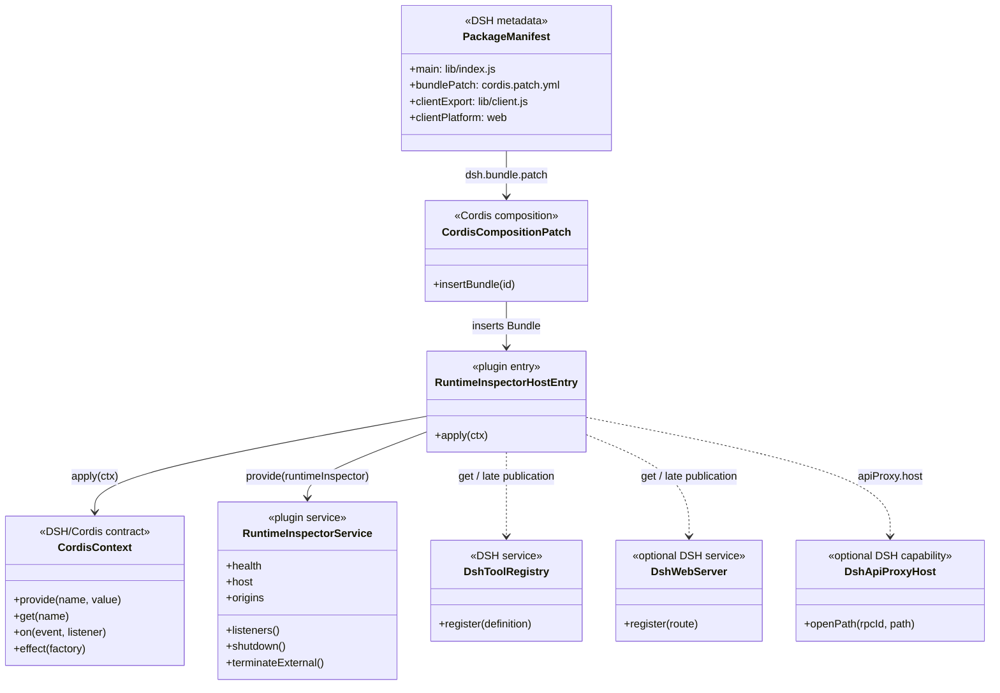
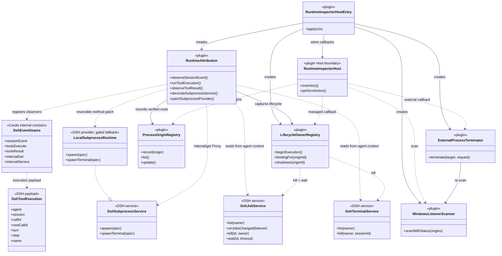
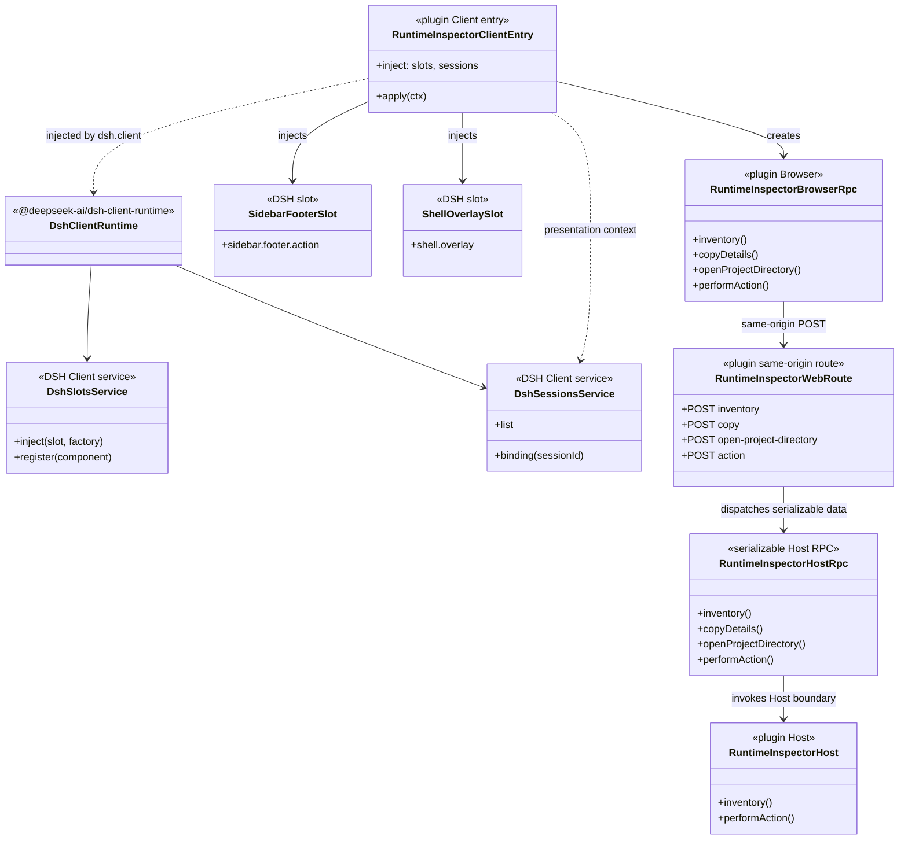
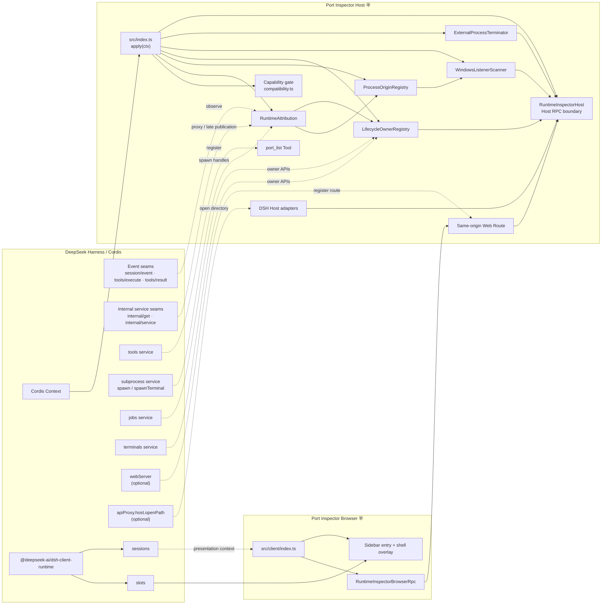
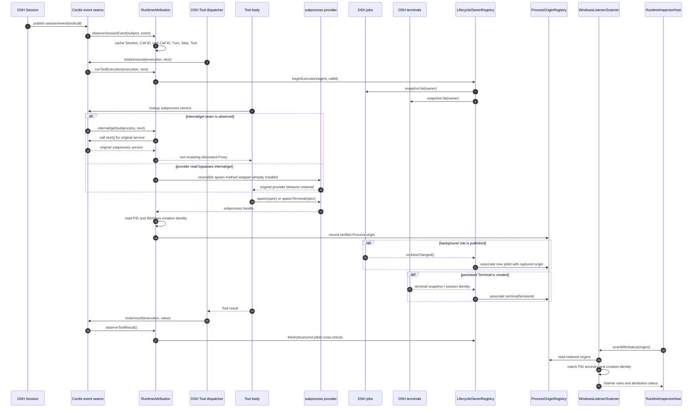
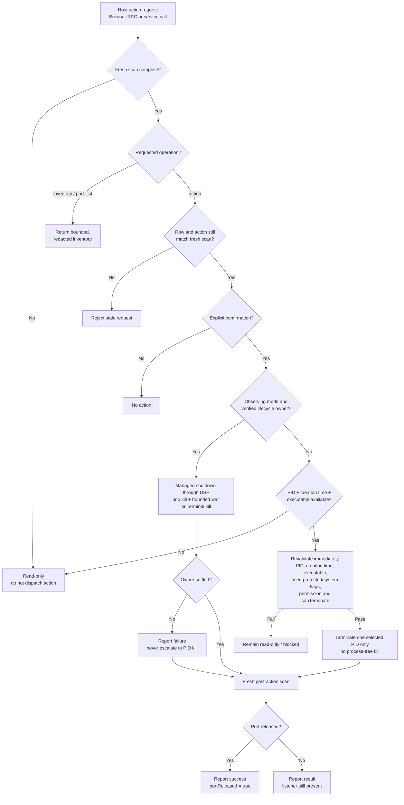

# DSH Port Inspector：DeepSeek Harness 集成机制与类图

> 状态：代码核对版
> 日期：2026-08-25
> 范围：说明 Port Inspector 作为 DeepSeek Harness 插件时实际使用的 DSH/Cordis 机制、服务契约和 Host/Browser 边界。

## 说明

本文档只描述代码和现有设计文档明确支持的关系。图中的 `Dsh*` 类型是 DSH 服务或事件契约的接口模型，不表示这些类都定义在本项目中。

图例：

- 实线：插件直接创建、调用或提供的对象。
- 虚线：事件监听、服务查找、可选能力或上游间接依赖。
- `<<internal contract>>`：Cordis/DSH 内部运行时 seam，不应描述成稳定的公开扩展 API。
- `<<optional>>`：能力不存在时，插件仍可保留其他功能，但会按能力降级。

## 1. DSH 集成点总览

| DSH 机制或组件 | 插件的实际用法 | 关系性质 |
| --- | --- | --- |
| Bundle composition | `package.json` 声明 `dsh.bundle.patch`，由 `cordis.patch.yml` 插入 `dsh-port-inspector` Bundle | 直接 |
| Cordis Context | Host 入口使用 `ctx.provide`、`ctx.get`、`ctx.on` 和 `ctx.effect` | 直接 |
| `internal/get` waterfall | 在读取 `subprocess` 时创建 non-mutating Proxy，只包装 `spawn` 和 `spawnTerminal` | 直接，内部 seam |
| `internal/service` | 监听 `subprocess`、`tools`、`webServer` 的延迟发布 | 直接，内部 seam |
| `tools/execute` | 为每个 Tool Execution 建立 AsyncLocalStorage 上下文 | 直接 |
| `tools/result` | 读取结果中的 `jobId`，与生命周期捕获结果交叉校验 | 直接 |
| `session/event` | 缓存 `tool/call` 的 Session、Turn、Step、Call ID 和 Tool 信息 | 直接 |
| `subprocess` | 观察 `spawn`、`spawnTerminal` 返回的句柄和 PID；不接管 Provider 所有权 | 直接 |
| `jobs` | 使用 `list`、`onJobsChanged`、`kill`、`wait` 关联并关闭受管后台任务 | 直接，通过 Tool Execution context 获取 |
| `terminals` | 使用 `list`、`kill` 关联并关闭受管持久终端 | 直接，通过 Tool Execution context 获取 |
| `tools.register` | 注册只读 `port_list` Tool | 直接 |
| `webServer.register` | 注册同源 Web Route，连接 Browser 和 Host | 可选 |
| `apiProxy.host.openPath` | 由 Host 打开项目目录 | 可选 |
| `dsh.client` | 声明 Web Client 入口，并注入 `@deepseek-ai/dsh-client-runtime` | 直接 |
| Client `slots` / `sessions` | 注册 Sidebar/Overlay 插槽，读取当前 Session 的展示上下文 | 直接 |

### 1.1 插件自有的兼容性 Gate

兼容性探测不是 DSH 提供的一个服务，而是插件围绕 DSH runtime contract 建立的安全边界。`src/compatibility.ts` 会检查平台、observer contract、`subprocess` provider、`spawn` 和 `spawnTerminal` 能力；`src/version.ts` 读取已安装 DSH 包版本作为诊断信息。版本号不是公共功能总开关，只有 delayed-Terminal PID 的私有 shape 修复使用精确版本和形状 gate。

因此，图中应把兼容性探测标成插件自有组件，而不是画成 `DshCompatibilityService`。

相关实现和依据：

- [package.json](../package.json)、[cordis.patch.yml](../cordis.patch.yml)
- [src/index.ts](../src/index.ts)、[src/attribution.ts](../src/attribution.ts)、[src/lifecycle.ts](../src/lifecycle.ts)
- [src/web-bridge.ts](../src/web-bridge.ts)、[src/dsh-adapters.ts](../src/dsh-adapters.ts)
- [src/client/index.ts](../src/client/index.ts)、[src/client/slots.ts](../src/client/slots.ts)、[src/client/bridge.ts](../src/client/bridge.ts)

## 2. Bundle 与 Cordis 集成类图



## 3. Tool、Subprocess 与生命周期类图



核心运行链路：

```text
session/event(tool/call)
    → tools/execute
    → AsyncLocalStorage Tool Context
    → subprocess.spawn / spawnTerminal
    → ProcessOriginRegistry
    → Job / Terminal owner association
    → WindowsListenerScanner
    → Host inventory / action
```

需要区分两种操作路径：

- Managed shutdown：Host → `LifecycleOwnerRegistry` → DSH `jobs.kill + wait` 或 `terminals.kill`。
- External termination：Host → `ExternalProcessTerminator` → Windows 单 PID 身份复核和终止；这不是 DSH 的生命周期 API。

## 4. DSH Browser Client 与 Host 桥接类图



Browser 侧只负责展示和发起序列化请求：

- 不接触 Windows Scanner、Koffi、进程句柄、Job/Terminal API 或终止原语。
- `sessions` 提供的 Session ID、标题、cwd 和 conversation 只用于展示和隐私投影。
- Browser 传入的 `currentSessionId` 不授予任何 managed 或 external action 权限。
- Host 仍然是进程状态、身份复核和操作权限的唯一决策边界。

## 5. 运行时组件关系图

这张图将 DSH 提供的服务、插件自有组件和 Browser 半放在同一张图中。`Shell` 或 PowerShell Tool 没有作为插件的直接调用者绘制；它们最终使用 `subprocess`，属于插件观察到的上游执行路径。



## 6. 端口来源归因时序图

这条时序展示一次 Tool Call 如何从 Session 事件变成可用于端口匹配的 Process origin。`internal/get` Proxy 和 `LocalSubprocessRuntime` fallback 是两种可选观察 seam，不代表插件同时替换两个 Provider。



## 7. 安全处理决策图

安全决策必须在 Host 侧完成。Browser 和 `port_list` 只能获得序列化结果，不能绕过以下分支。



## 8. 需要在 README 中避免的关系

以下关系与当前代码不符：

```text
Browser → DshJobService
Browser → DshSubprocessService
RuntimeInspectorHost → DshShellProvider（直接调用）
RuntimeAttribution → owns subprocess provider
RuntimeInspectorHost → owns ExternalProcessTerminator
```

更准确的表述是：

- Shell、PowerShell Tool、后台任务和持久终端是插件观察到的 DSH 上游执行路径，不是插件的主要直接调用入口。
- 插件直接依赖的是 `tools/execute`、`session/event`、`subprocess`、`jobs` 和 `terminals` 等契约。
- `RuntimeInspectorHost` 接收 Scanner、origin provider 和 action callbacks，不拥有这些资源。
- `internal/get` Proxy 和 `LocalSubprocessRuntime` fallback 是兼容性观察机制，不是 Provider replacement。

## 9. 代码与文档依据

- [MVP 文档](dsh-port-inspector-mvp.md)
- [Implementation Spec](dsh-port-inspector-mvp-spec.md)
- [Root PID research](dsh-port-inspector-root-pid-research.md)
- [ADR-0001：Stock DSH root PID observation](adr/0001-stock-dsh-root-pid-observation.md)
- [ADR-0004：单仓库 DSH Web 双半 Bundle](adr/0004-web-client-dual-face-bundle.md)
- [ADR-0005：Capability-based DSH compatibility](adr/0005-capability-based-dsh-compatibility.md)
- [Bundle manifest tests](../tests/bundle-manifest.test.mjs)
- [Plugin lifecycle tests](../tests/plugin-lifecycle.test.mjs)
- [Browser slot tests](../tests/client-slots.test.mjs)
- [Stock DSH Bundle smoke test](../tests/dsh-bundle-smoke.test.mjs)
